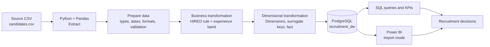

# Architecture diagram

```mermaid
flowchart LR
    A[Source CSV\ncandidates.csv] --> B[Python + Pandas\nExtract]
    B --> C[Prepare data\ntypes, dates, formats, validation]
    C --> D[Business transformation\nHIRED rule + experience band]
    D --> E[Dimensional transformation\nDimensions, surrogate keys, fact]
    E --> F[(PostgreSQL\nrecruitment_dw)]
    F --> G[SQL queries and KPIs]
    F --> H[Power BI\nImport mode]
    G --> I[Recruitment decisions]
    H --> I
```
