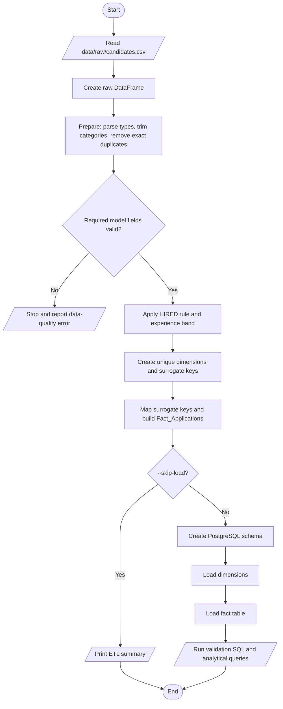

# Program flow diagram

```mermaid
flowchart TD
    A([Start]) --> B[/Read data/raw/candidates.csv/]
    B --> C[Create raw DataFrame]
    C --> D[Prepare: parse types, trim categories, remove exact duplicates]
    D --> E{Required model fields valid?}
    E -- No --> F[/Stop and report data-quality error/]
    E -- Yes --> G[Apply HIRED rule and experience band]
    G --> H[Create unique dimensions and surrogate keys]
    H --> I[Map surrogate keys and build Fact_Applications]
    I --> J{--skip-load?}
    J -- Yes --> K[/Print ETL summary/]
    J -- No --> L[Create PostgreSQL schema]
    L --> M[Load dimensions]
    M --> N[Load fact table]
    N --> O[/Run validation SQL and analytical queries/]
    K --> P([End])
    O --> P
```
